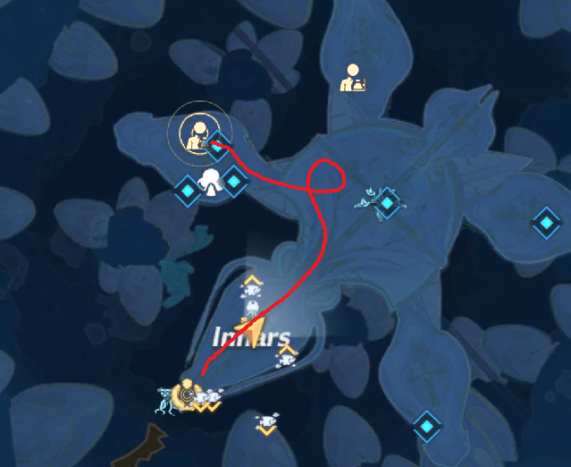
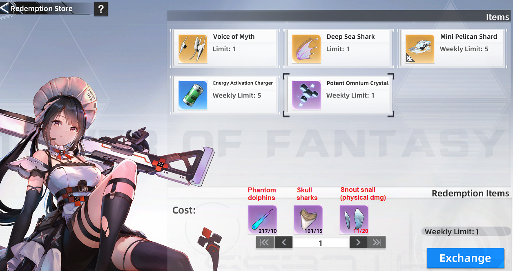
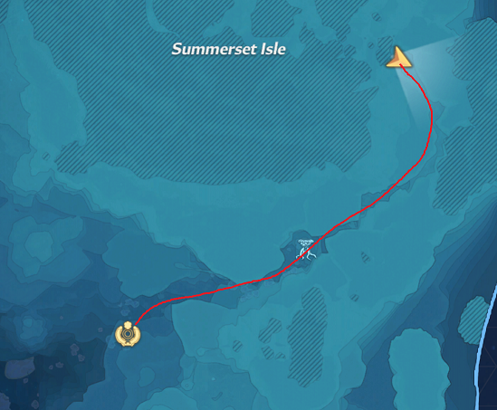
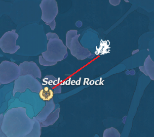

# Checklists
There are many daily, weekly, monthly, and one-off tasks/activities to do in ToF, so it becomes too difficult to remember everything.

## Daily

- [ ] Daily Bounty
- [ ] Mia's Kitchen
- [ ] Joint Operation
- [ ] Sign-in reward
- [ ] Artificial Island vendor check
- [ ] Domain 9 trading/price check (Tianha Bazaar)
- [ ] Domain 9 elixir pills price check/purchase (Tianha Bazaar)
- [ ] Appointed Research
- [ ] Crew Donation
- [ ] Aesperia Claw Machine gift x3 (Cetus Island)
- [ ] Aesperia Black Market free gift x1 (Hopkins NPC)
- [ ] Mirroria vending machine gift purchase
- [ ] Returnee points - 1500 support points & 600 returnee points (Raid or Void Abyss)
- [ ] Training console - for Commissary Points store
- [ ] Mirroria daily fun zone minigames

## Weekly

- [ ] Raid [challenge] (Monday)
- [ ] Final Trial [normal] (Monday)
- [ ] Claim weekly Crewbox
- [ ] Commissary - Crystal Dust Store weekly limited items
- [ ] Commissary - Spacetime Store weekly limited items
- [ ] Commissary - Suppport Store weekly limited items
- [ ] Commissary - Multiverse Store weekly limited items
- [ ] Mentorship rewards & store
- [ ] Multiverse Hunt x4
- [ ] Bygone Phantasm
- [ ] Sequential Phantasm
- [ ] Any regular World Boss x10 for Augment module box V (Aesperia, Vera, Domain 9, Network)
- [ ] Any Mecha/Kailo World Boss x10 for Augment module box VI (Gunner, All seeing eye, Queen Xeno)
- [ ] Claire's Dream Machine x3
- [ ] Void Abyss - claim free Void energy
- [ ] Potent Omnium Crystal weekly exchange (Resource Dealer)
- [ ] Mirroria M-Sec missions x3 (Security Force)
- [ ] Artificial Island boss rewards x4
- [ ] Artificial Island Weapon Augment boxes and materials purchase
- [ ] Domain 9 Gift Merchant - Hua Yueli weekly limited gifts (Hexa County)
- [ ] Domain 9 Gift Merchant - Qiu Yao weekly limited gifts (Nona County)
- [ ] Domain 9 Dominium quests
- [ ] Network convert Data Sources to Norn at Yellow terminals
- [ ] Network Gift Merchant - Alicia weekly limited gifts & emotes (Astra Resort)
- [ ] Network Trade Warehouse - Rail NPC Mecha upgrades (Gesthos smart city)
- [ ] Network Cipher Exchange - hacking game (Indoor zone - Observation Deck Subway Station)
- [ ] Network Norn quests
- [ ] Network Norn minigames
- [ ] Kailo Anchor Supply Shop

## Monthly

- [ ] Artificial Island monthly rewards (Special voucher x4)
- [ ] Void Abyss
- [ ] Origin of War
- [ ] Evolution Frontier
- [ ] Break from Destiny - 1 game
- [ ] Clotho Supply Pod claim & reset

## One-off

- [ ] PvP Arena - 1 game
- [ ] Evolution Vanguard
- [ ] Ruins
- [ ] Mirroria Gachapon
- [ ] Innars red nucleus hidden quest
- [ ] Domain 9 statue upgrades
- [ ] Domain 9 Four Symbol Cauldron
- [ ] Network Dandelion Redemption Store (Rocken Park)
- [ ] Network Hacker game
- [ ] Kailo Amos shop
- [ ] Kailo targets/quests (TODO)

### Asperia

### Vera

#### Potent Omnium Crystal weekly exchange

You can get 1 per week from the NPC Ranni in Innars. It may be worth doing now that we get double weekly Potent Omnium Crystals in order to upgrade your Supressor faster.

To reach Ranni, go to the `Spacerift: Innars` teleporter on level 2 of Innars. Then follow the route in red to go down the stairs on the left and take the first right.

You'll need 3 items to exchange and I've written on the image which creature to farm it from.

<ins>**Snout Snail x20**</ins>

You must use a **Physical** weapon to kill the snail for the correct item drop, otherwise you'll get a different item. Also make sure your smart servant doesn't kill the snail if it's not doing Physical damage.

North East of Ranni you'll find the teleport `Spacerift: Dark Source Sidewall`. From here, follow the route as shown below where you can find plenty of snails, as well as dolphins and sharks! I'd recommend going to the end of the route then going back towards the teleporter to find extra enemies that appear from hiding or respawn. One run is enough to get the 20 snail items.

<ins>**Skull Shark x15**</ins>

You can AFK farm these at the boar icon spot below, near the `Spacerift: Central Secluded Rock` teleporter. For a video guide then see Gateoo's guide [here](https://youtu.be/Up2-epfHWWs?list=PLexT4z6TXJCGFO9A7wQ4YvDev5Cto2JSF&t=720)

<ins>**Phantom Dolphin x10**</ins>

The snout snail farming route should provide enough materials.

### Domain 9

### Network

### Kailo
