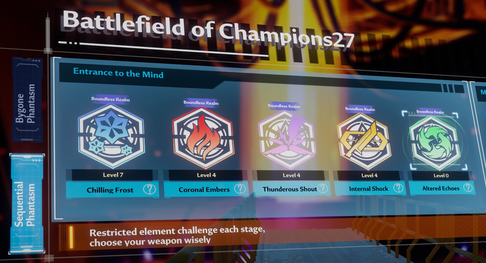

# Sequential Phantasm
An almost hidden game mode until you can figure out where it lives in the UI!

## Menu location
Go to Bygone Phantasm and it will be a vertical tab on the left of the screen.

In the picture below, click the circled buttons to toggle between Bygone Phantasm and Sequential Phantasm!

## Boundless Realm Mode
Reach 3500 points for any element to unlock boundless realm mode for that element only. Do this for each element to unlock boundless for all elements.

## Altered mode
Reach Boundless Realm mode stage 5 in each of the 4 elements to unlock it. So each of the 4 main elements must display level 4 as shown below (level 0 comes first).

Note - it seems that the maximum altered level you can access is limited by your maximum level in all other elements. E.g. if flame, volt, physical & frost show level 4, then level 3 is the max you can access, and when the 4 main element level is 5 then you can access level 4 altered etc.