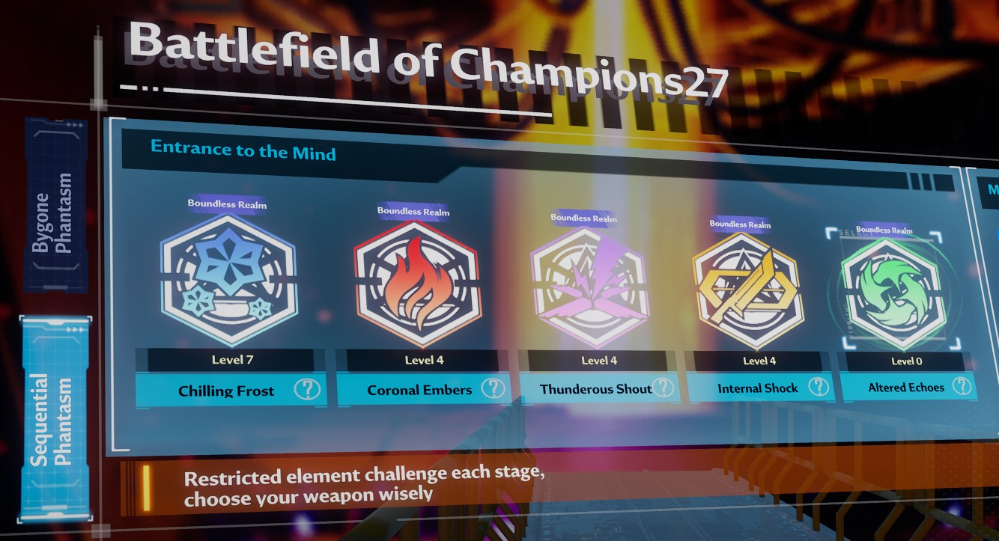

# Sequential Phantasm
An almost hidden game mode until you can figure out where it lives in the UI!

## Menu location
First find Bygone Phantasm.

Go to Bygone Phantasm and there will be a vertical tab on the left of the screen.

In the picture below, click the circled buttons to toggle between Bygone Phantasm and Sequential Phantasm!

## Boundless Realm Mode
Reach 3500 points for any element to unlock boundless realm mode for that element only. Do this for each element to unlock boundless for all elements.

## Altered mode
Reach Boundless Realm mode stage 5 in each of the 4 elements to unlock it. So each of the 4 main elements must display level 4 as shown below (level 0 comes first).

Note - it seems that the maximum altered level you can access is limited by your maximum level in all other elements. E.g. if flame, volt, physical & frost show level 4, then level 3 is the max you can access, and when the 4 main element level is 5 then you can access level 4 altered etc.

## Max level
Level 17 is the current maximum for each main element as of January 2025.

For Altered it's a bit lower at 8 (Dec 2024).

## Buffs
Use various buffs to increase your power:

- Mia food buff daily (x3 that can stack)
- Food item buffs, i.e. purple food that give 2% element specific atk% for example
- Mentorship Store Adrenaline Serum: Sequential Phantasm (+1000 atk)
- Domain 9 boosters weekly purchase located in Tianhe Bazaar. Buy the boosters with Dominium currency.
  - Enhancement Shot (Jing Dan merchant) - Increase the base stats of the equipped weapons and Matrices to as if they're at max stars for 7 days.
  - Piercing Shot (Jing Dan merchant) - Regenerate 600 endurance. Increase shatter by 15% and aggro by 25% for 7 days.
  - Enhanced Blade Shot (Jing Dan merchant) -  increase ATK by 3.5% for 7 days (does not stack with the regular Blade Shot)

## General guide
TODO

## Specific levels tips
For some levels there are special mechanics that increase the difficulty to some degree.

### Level 6
Boss name:
Darkness: Fulmination

The boss is chained to a platform and doesn't come down until 1:10 left on the clock!

1. Early on in the fight defeat the spears
2. Dodge the energy balls or hide behind a cube
3. Unload everything you have when the boss comes down at 1:10

## Level 8
Boss name: (puppet)

## Level 13
Boss name:
Darkness: Flywing

