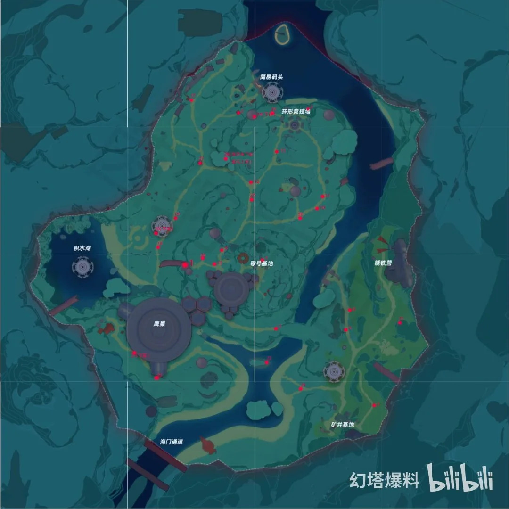

## Mysterious Vendor - Jack
Every day from 12:00 there is a small chance for the vendor to appear on your Artificial Island to give free rewards, including:

- Red Nucleus
- Special Voucher
- Gold Nucleus
- Proof of Purchase
- various gear upgrades

Full list of items here https://toweroffantasy.fandom.com/wiki/Mysterious_Vendor

The vendor will leave the island after 12 hours.

## How to check if Jack is visiting your island

Go to the Adventure menu (Alt+3), click `Casual`, then `Artificial island construction`

An icon of Jack will appear next to the `Go` button as shown below. Click on the `Go` button to teleport to the island.

## Vendor location

The vendor can appear at any one of the red dot locations shown below.

He only appears when you're very close to him in both the map and visible draw distance.

## Visitor settings

You can share Jack's gifts with others by clicking on the `visitor settings` button to the left of `Go`. Any other player with the right permissions can visit your island and get most of the rewards like gold nucleus. Only the red nucleus and red voucher are exclusive to the island owner, so can't be shared.

