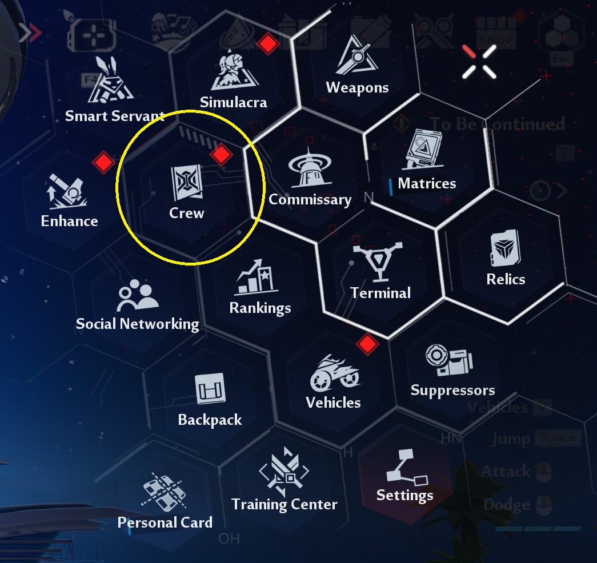
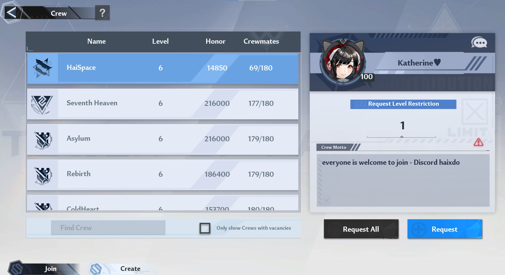
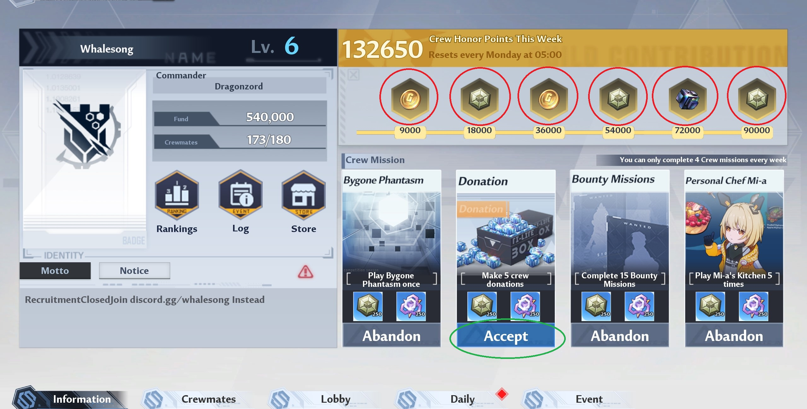
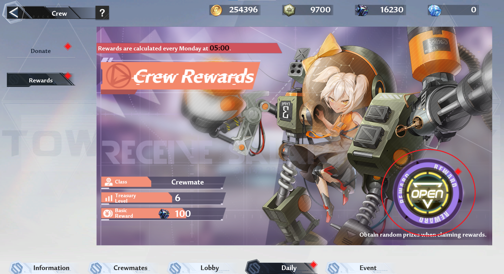
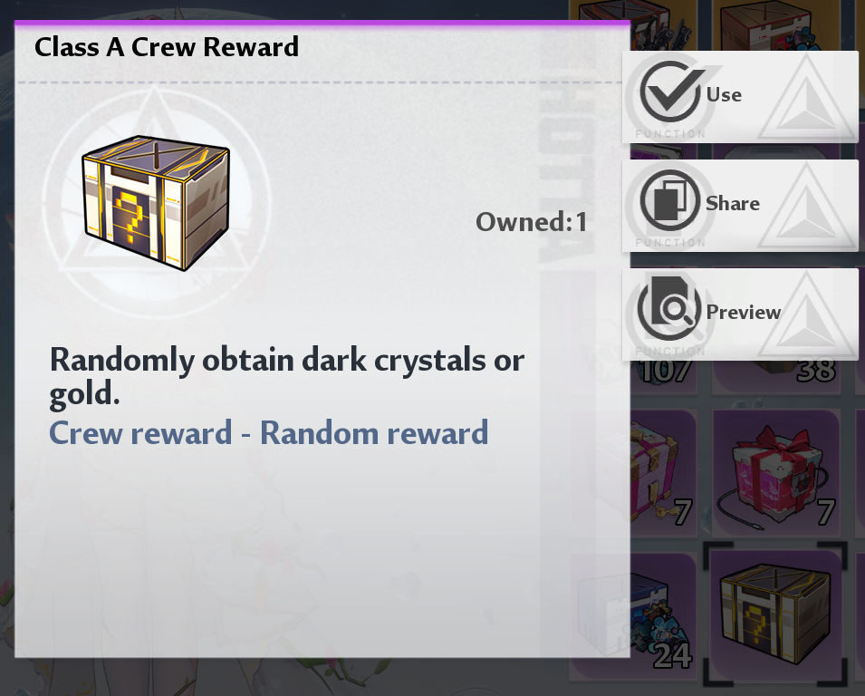
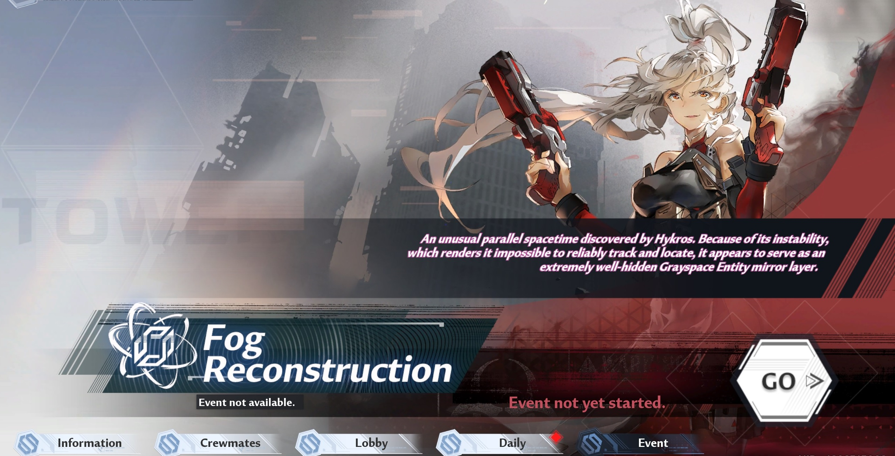

# Crew

This is the guild system in ToF where up to 180 players can be in a crew. It's 100% worth putting in effort to find an active crew as you'll have more people to play with and will get decent rewards from being in a crew, such as weekly DC,  `merit` (crew currency) and extra game modes to buy upgrades from the Crew shop.

## Joining a Crew

From the main menu find the Crew button.

Now you'll see a list of all Crews, and can request to join one that isn't full.

Simply find one that look active based on users, language, honour points etc and put in a request. Sorting functionality is limited though.

## Crew requirements and discord

Note that some Crews will have specific requirements and you might need to also join their Discord server first to apply from there too. Usually they'll tell you in the description box and will usually be in the format discord.gg/<crew_name> or discord.gg/<server_id>.

If you see a Discord server ID while is an alphanumberic string of varying length like `a4ZbBHb6` then use the link https://discord.com/invite/a4ZbBHb6 to join (example only, not a real ID).

## Crew missions & rewards

Once you're in a crew, visit the Crew menu again and you'll see some different screens.

There's two important areas in the first information tab. You will see 4 crew missions in the bottom right. Make sure you `Accept` these and completing them will help build honour points for the crew. When properly accepted then the button will say `Abandon`.

The second important area is about the crew missions where everyone in the crew can claim rewards based on how many honour points is built up from completing crew missions and making daily donations from the Daily tab.

When you build up enough points then you can click where the red circles are to claim the rewards which are Gold, Crew merits and 50 DC. This refreshes weekly on Monday morning and there's also a limit of how many crew missions you can do.

## Weekly rewards

Every week from Monday you can click on the purple circular button shown below to claim 100 DC and a crew reward box.

You can find the crew reward box from your backpack, and opening gives you a random gift which be either DC or Gold. The maximum DC you can get is 500.

## Crew events

The main event for crews is Fog Reconstruction which happens every few months. You work on this as a crew and can obtain various rewards like gear and upgrades.

You can find more information here or by searching YouTube https://toweroffantasy.fandom.com/wiki/Fog_Reconstruction