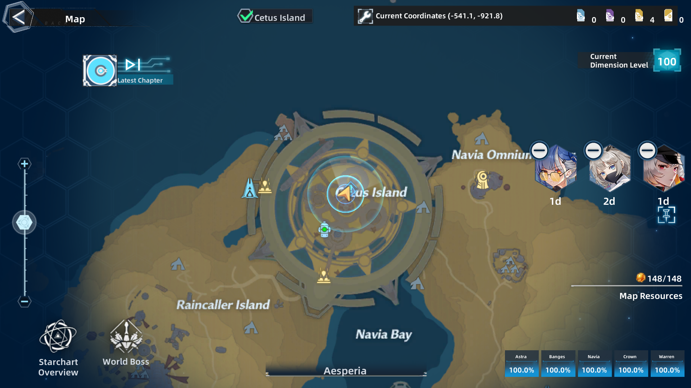
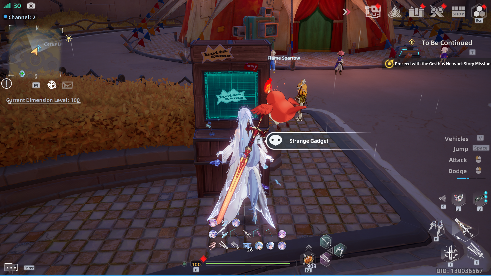
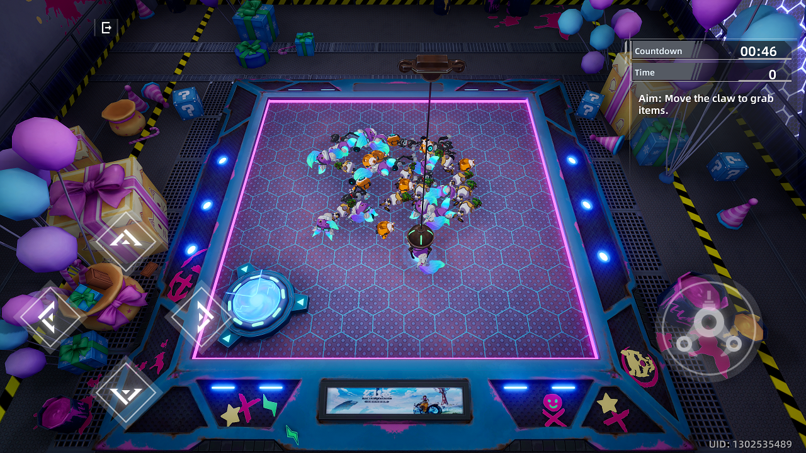
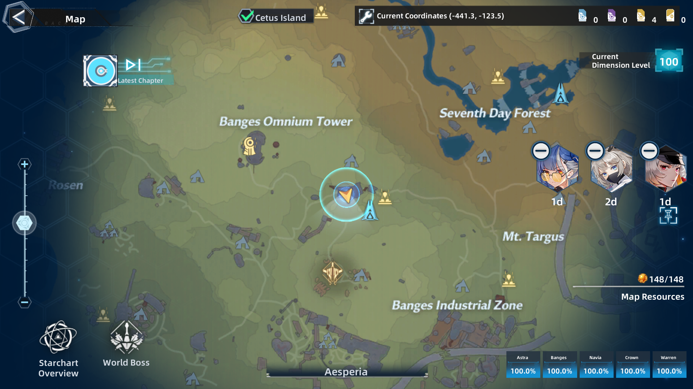
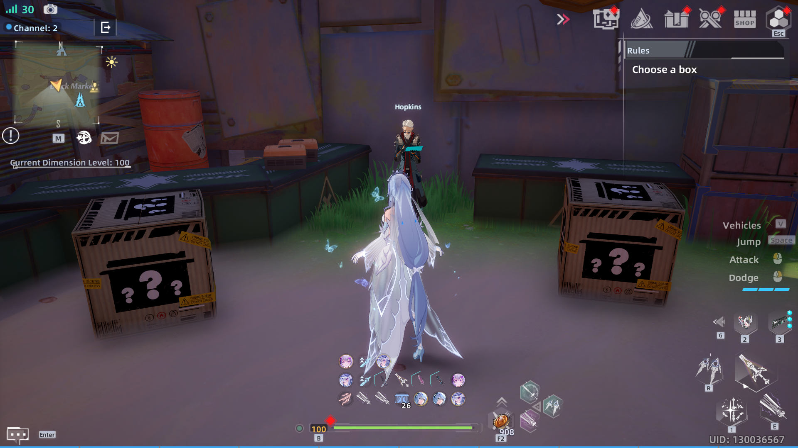
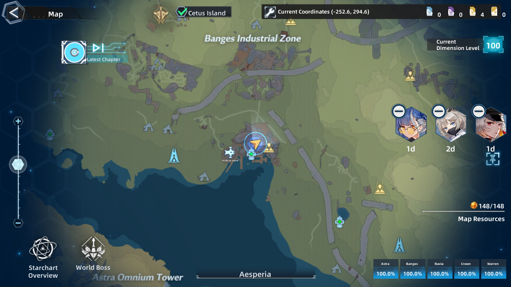
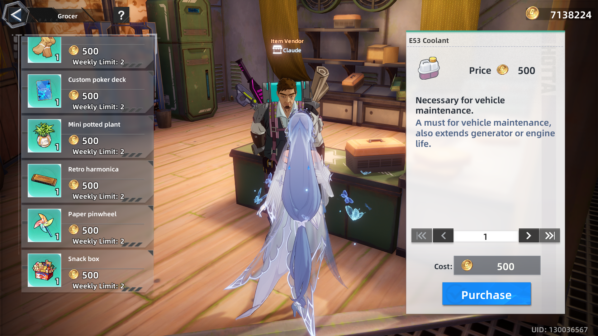

# Gifts
- Gifts are used for **Awakening** a character, unlocking Traits and permanent damage boosts.
- The maximum Awakening points a single gift can add is either **80 or 100** depending on the character.
- Gifts are **World-specific**, so since patch 4, there are: **Aesperia, Vera, Domain 9, and Network gifts**.

## 📌 Table of Contents
- [How to Obtain Gifts](#how-to-obtain-gifts)
- [Aesperia Gifts](#aesperia-gifts)
  - [Farm Free Daily Gifts](#farm-free-daily-gifts)
  - [Buy Aesperia Gifts](#buy-aesperia-gifts)
- [Vera Gifts](#vera-gifts)
- [Domain9 Gifts](#domain9-gifts) [TODO]
- [Network Gifts](#network-gifts) [TODO]

---

## How to Obtain Gifts
_Coming soon..._

---

## Aesperia Gifts
### Farm Free Daily Gifts
#### 1️⃣ Claw Game (Best Free Gift)
- **Location**: North of the map (teleporter circled below)
- **How to Play**: Move the claw using `WASD` (PC) and aim for the **Smarty Doll**.
- **⚠️ Bug Warning**: Claw machine may not work properly on Android.
- **🖼 Image**:
  
  
  _Go to the circled teleporter to find the claw machine._

  
  
  _You get 3 daily chances to win a gift._
  
  
  
  _Aim for the Smarty Doll to get the best rewards._

#### 2️⃣ Black Market Vendor
- **NPC**: Hopkins
- **Location**: Middle of the map
- **Reward**: Lower-quality gift compared to the claw machine
- **How to Obtain**: Speak to him and choose any of the two boxes to get a daily gift.
- **🖼 Image**:
  
  
  _Find Hopkins in the middle of the map._

  
  
  _Select a box to receive a daily gift._

---

### Buy Aesperia Gifts
**Weekly purchases have a low limit per item.**

#### 1️⃣ **Balmart Grocery Store**
- **Location**: Banges (Upper Level, above teleporter)
- **Currency**: Gold
- **🖼 Image**:
  
  
  _Find the store towards the lower-left of the map._

  
  
  _Use gold to buy gifts._

#### 2️⃣ **Other Shops**
| Store Name                  | Location             | Currency                  |
|-----------------------------|----------------------|---------------------------|
| **Commissary Shop**        | Main Menu           | Gold Dust / Training Points |
| **Artificial Island Store** | Artificial Island   | Special Tokens             |

  
  

---

## Vera Gifts
_You'll need **World specific currency** to buy gifts._

---

## Domain9 Gifts
_You'll need **World specific currency** to buy gifts._

---

## Network Gifts
_You'll need **World specific currency** to buy gifts._

**Norn** is the currency used, which you can get by collecting data sources (floating blue balls) around the map and in daily commissions then converting them to Norn at **yellow** terminals dotted around the main Network map.

---
