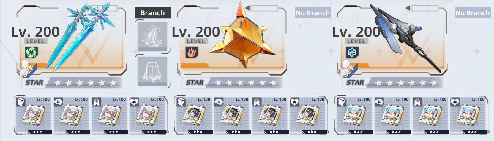
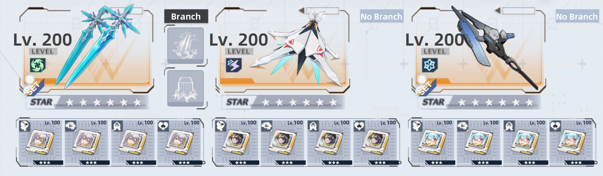

# Cocoritter (Absolute Zero)
Frost Benediction unit released at launch in version 1.0.

## Element Type  
 **Frost**  
 - When the weapon is fully charged, the next attack will freeze targets for 2 seconds and leave them frostbitten for 6 seconds.
 - Breaking the ice shell causes additional damage equal to 151% of ATK.
 - While frostbitten, the target's weapon charge rate is reduced by 50%.

## Elemental Resonance  
 - **Frost Resonance**: Activate by equipping 2 or more frost weapons. Increase frost ATK by 15% and frost resistance by 25%. This set effect works in the off-hand slot. Cannot stack with effects of the same type.
 - **Frost Benediction**: Increase the entire team's frost ATK by 5% when Benediction Resonance is active.

---

## Kit and Gameplay

<iframe width="720" height="480" src="https://www.youtube.com/embed/GytwiSnZnFI" frameborder="0" allow="accelerometer; autoplay; clipboard-write; encrypted-media; gyroscope; picture-in-picture" allowfullscreen></iframe>

---

## Guide and Team Comps

Cocoritter is a powerful healer and damage booster with an additional passive charge rate from her healing drone. She's a discharge unit that spends most of the time in the off hand, giving space for other weapons to have time in main hand. Her kit is very simple but requires a lot of skill to use it to its full potential.

Despite how strong her kit is, she heavily relies on charge rate from other weapons and positioning of the player in fights. Her skill has a long 60s cooldown, and her discharge forces us to stay near our DPS for them to fully utilize it's healing and damage boost.

In the current state of game, she's still a solid pick for most of the content, but some bosses deny usability of her discharge because of their high mobility. Even with her dispelling and crowd control immunity, she can't get rid of greybites. Therefore, using new benediction weapons for solo content is required.

For her build, due to the fact that she's an off field discharger, matrices like Brevey, Grey Fox and Fiona will work perfectly. Not only will those options bring a lot of freedom for other weapon to shine with Cocoritter or Zero matrices in main hand, but also enable smooth transitions in gameplay.

One word: Fiona. Cocoritter requires as much charge rate as possible, and the best source for that is Fiona. This combination allows us to use Cocoritter's discharge repeatedly while providing our allies with not only a permanent boost and healing but also burst healing and charge rate from Fiona's dodge attacks. Additionally, Fiona can serve as our main-hand weapon.

As for off-field weapons, Lyra would be a great fit due to her strong defensive boosts and shielding. Brevey and Grey Fox could take on both off-field and on-field roles in this team, offering burst healing outside of Fiona's dodge, cleansing graybites, and providing off-field boosts for teammates. On top of that, they enhance Cocoritter's healing potential. Zero would also work well as an on-field weapon, supporting Cocoritter's discharge healing with his orbs and high charge rate.

As for the trait, Brevey is the way to go for all comps, but personally I would use her as a pair with Grey Fox’s trait. That duo not only perfectly covers each other's flaws, but also gameplay with them fells very smooth and running out of charge rate will never be a problem. It's also possible to use Cocoritter's trait, but this would make it difficult to maintain the boost from both the trait and discharge. 

A final small tip for gameplay, remember to use Cocoritter's dodge after every 2-3 discharges to resummon the healing drone and build additional charge rate.
	
---

## Team Comps

Here are some example teams to work towards. If you're a beginner and have Cocoritter, then aim to get any other standard Benediction characters like Nemesis, Zero or Pepper.

- If you don't own Fiona, she can be replaced with Cocoritter
- If you don't own Brevey she can be replaced with Lyra
- Fiona's matrices can be replaced by P2 Lyra and P2 Nemesis or another set of P4 Zero or Cocoritter matrices

In this team:
1. Fiona is an off field buffer.
2. Cocoritter is discharge unit.
3. Grey Fox in on field healer.
   

In this team:
1. Fiona is an off field buffer.
2. Zero is on field buffer.
3. Cocoritter is discharge unit.
   

In this team:
1. Fiona is an off field buffer.
2. Brevey is on field healer
3. Cocoritter is discharge unit.

---

## Advancements

| ★ | Effect |
|---|--------|
| **1** | After dodging, summon a healing bee that follows the user and heals the ally with the lowest percentage of HP within 15 meters. Heal for 25% of ATK and restore 50 weapon charge points each time and lasts for 25 seconds. Cooldown: 25 seconds. |
| **2** | Increase the current weapon's base HP growth by 16%. |
| **3** | Use Sanctuary or discharge skills to remove debuffs from targets, can be used while being affected by control effects. Increase shatter and damage dealt for all teammates within range by 20%, and grant them immunity to control effects and shatter. |
| **4** | Increase the current weapon's base HP growth by 32%. |
| **5** | Increase healing effect by 15%, plus an additional 20% when healing targets with less than 60% HP. |
| **6** | Whenever a healing bee is summoned or disappears from battle, heal all allies for 100% of the user's ATK. All allies within 10 meters of the healing bee also gain 15% all damage and healing boost (cannot stack). |

---

## Matrix Set

| Set Bonus | Effect |
|-----------|--------|
| **2-piece** | Increase healing capability and healing received by 10% / 12% / 14% / 16%. |
| **4-piece** | When you or your teammates are healed, increase ATK by 12.5% / 15% / 17.5% / 20% for 6 seconds. Only the highest level's effect is applied when obtained repeatedly. |

---

## Trait

### **1,200 Awakening Points**  
**Cocoritter: Assistance**  
When Cocoritter uses a support weapon, increase healing effects she inflicts on others and receives by 20%.

### **4,000 Awakening Points**  
**Cocoritter: Trust**  
When Cocoritter uses a support weapon, increase healing and healing received by 20%. And when Cocoritter uses a support-type weapon's discharge skill or weapon skill, increase nearby allies' ATK by 15% for 5 seconds.
