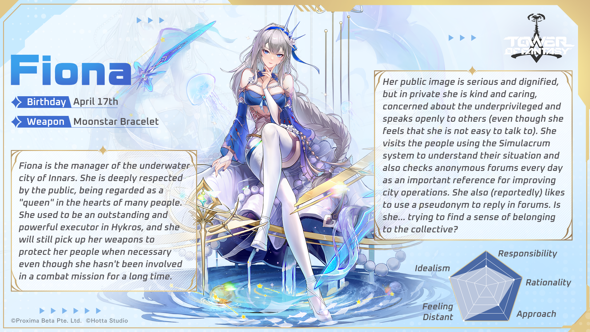

## Fiona
Fiona is the second Altered character that appeared during version 2. Her weapon is Moonstar Bracelet.

## Video guides

Magyi part 1 - https://www.youtube.com/watch?v=_5rz9ijFXjA
Michuzak Fiona skill guide - https://www.youtube.com/watch?v=jwDMT5GdqL4

## Tip 1
When in benediction mode you can link to an ally to provide them a buff depending on their resonance. This feature is called Division to use it you hold left click, target your ally, then release left click. You'll see a blue liquid  link to your ally.

If your ally is in attack/balanced resonance, then you provide +20% of your attack up to a maximum of 20,000 attack! This is likely the most common scenario to use Division so you can massively buff your main DPS in your team.

If your ally is in fortitude resonance (tank), this gives +50% of your resistance to them. And for benediction resonance it's +30% healing for both of you.

So now when a team mate says "link me", you know what to do.

## Tip 2
At Advancement 3 Fiona can execute (insta-kill) any enemy including bosses when they are below a certain percentage of health (maximum 12%). This makes her very useful in some content even today like in Raid events as this can be combined with Icarus's skill in benediction mode to take of a chunk of health from the start (8% of max HP). So a boss would take 8% off max health at the start and execute when the boss reaches around 12% health.

## Tip 3
Change Fiona's special skills depending on your resonance. You can select 2 at a time. 

See the video guides for more details and [Nola tip 1](https://tofnoob.github.io/weapons/nan_yin.html#tip-1) for where to configure the skills.