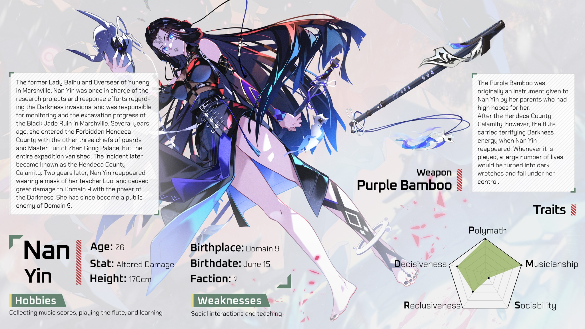
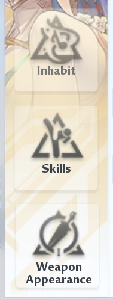
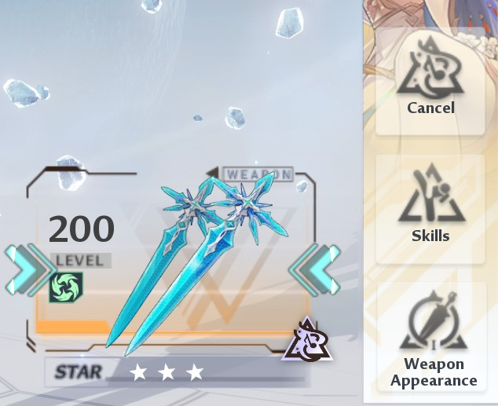
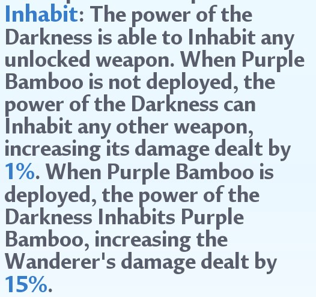
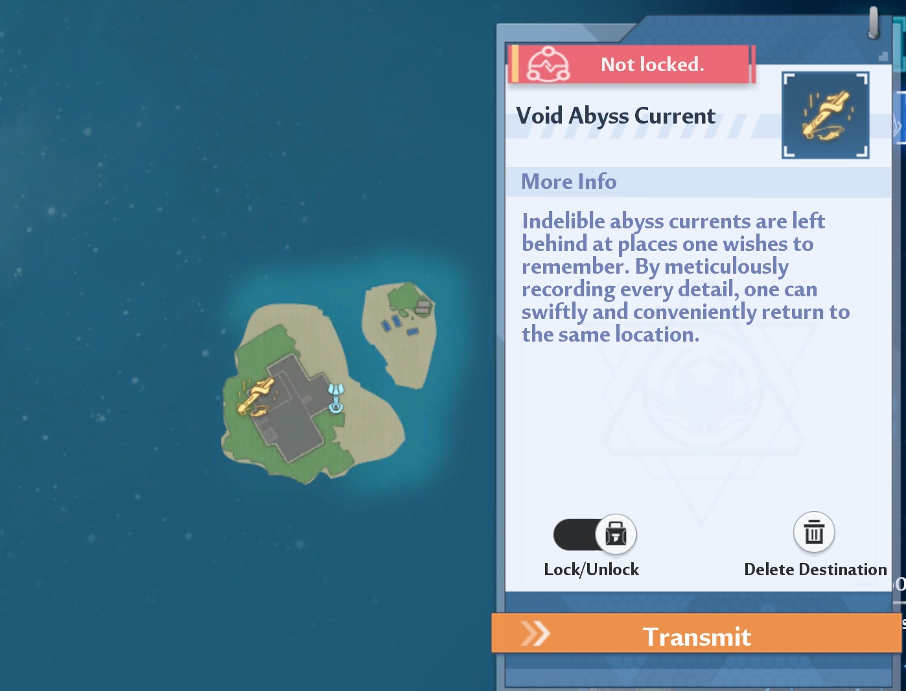

## Nan Yin
Nan Yin is the third Altered character that first appeared in version 3. Her weapon is called Purple Bamboo.

## Video guides

- Maygi part 1 - https://www.youtube.com/watch?v=gbeR_Szec5U
- Maygi part 2 - https://www.youtube.com/watch?v=X2EBoDxU3PE
- Redefine Gamer overview - https://www.youtube.com/watch?v=4bUmdVTsKLs
- Redefine Gamer rotations - https://www.youtube.com/watch?v=5E7uofDreXE

## Tip 1
Always remember to use Nan Yin's special **Inhabit** skill on your main DPS weapon. From the Weapons menu select any weapon that isn't Nan Yin and you'll see the Inhabit option.

After Inhabiting a weapon you'll now see a new icon appear on it.

Inhabit works even if Nan Yin is not on your team, but if on your team then it gives a 15% damage buff!! So always make sure you're using this feature.

## Tip 2
Nan Yin can create teleporters anywhere which is obviously incredibly useful. At Advancement 0 she can create up to 2 teleporters, and at Advancement 5 that limit increases to 3.

To make a teleporter hold left click when using Nan Yin.

View the map to see the Purple Bamboo icon that you can transmit (teleport) to. You can also lock it so that holding left click won't overwrite it, and can delete it from here.

If locked then you have to remember where you put your teleports as there isn't an option to auto-clear all of them. So you always have to manually search to map to delete or unlock them.