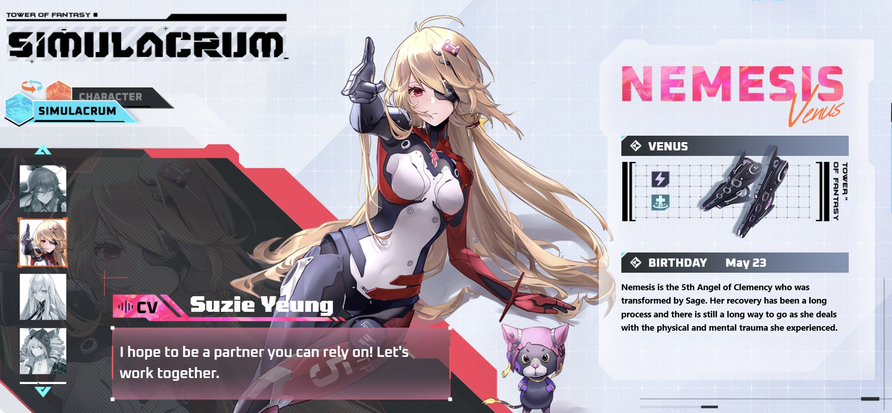
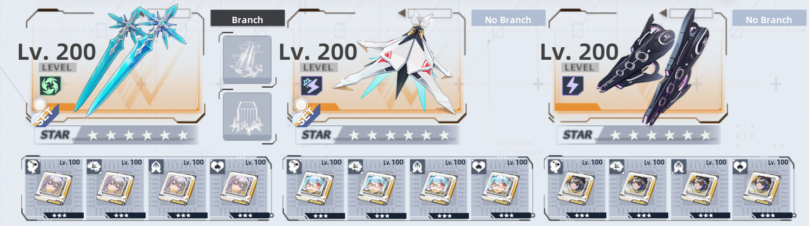
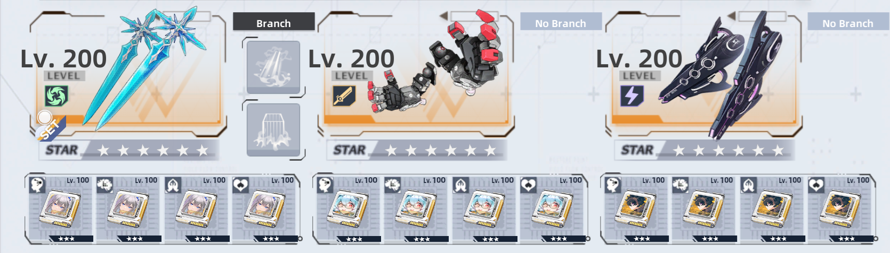
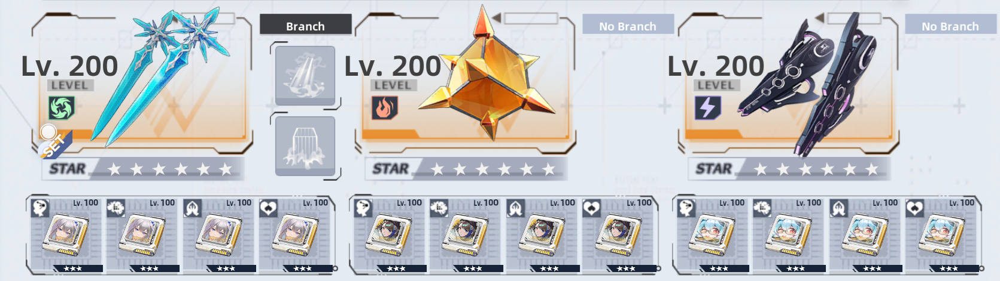

# Nemesis (Venus)
Benediction unit released at launch in version 1.0.

## Element Type  
 **Volt**  
When the weapon is fully charged, the next attack will strongly paralyze targets for **1 second** and electrify them for **6 seconds**, removing all their buffs and dealing damage equal to **144% of ATK**. Targets can't receive any buffs for the next **6 seconds**.

## Elemental Resonance  
- **Volt Resonance**: Increase **Volt ATK by 15%** and **Volt Resistance by 25%**. Activate by equipping **2 or more Volt weapons**. This set effect works in the off-hand slot. Cannot stack with effects of the same type.  
- **Volt Benediction**: Increase the entire team's **Volt ATK by 5%** when **Benediction Resonance** is active.  

---

## Kit and Gameplay

<iframe width="720" height="480" src="https://www.youtube.com/embed/btCemOMLq7c" frameborder="0" allow="accelerometer; autoplay; clipboard-write; encrypted-media; gyroscope; picture-in-picture" allowfullscreen></iframe>

---

## Guide and Team Comps

Nemesis as a unit brings a lot of burst and healing over time potential from her dodge, skill and discharge abilities. She can be used either as an on-field healer that provides necessary healing from her dodges, or a background healer that shows up in rough moments with a fully loaded kit. Her simple kit and easy gameplay are well suited for players that decide to try out Benediction.

Unfortunately, outside of her healing ability, she doesn't bring much utility in the current state of the game which often forces us to rely on newer units in team building. It’s also worth mentioning that she's the only Benediction weapon that doesn't have any team buffs implemented in her kit.

Nemesis relies a lot on dodge attacks, so her gameplay requires good resource management of the 3 dodge charges. Despite the fact that dodge cooldowns aren’t long, wasting a dodge before swapping to her can cause difficulties in keeping your team alive in the heat of battle.

As for her solo benediction build, it all depends if you decide on her being an on or off field support unit. Cocoritter matrices work very well with her because it’s simple to proc their passive ATK boost and additional healing bonus to her current kit. But it requires using her frequently every 6 seconds to maintain the boost for our allies. Pairing her with Lyra allows us to use her with Zero matrices. It would force Nemesis to be on field most of the time, but with her healing power there's no need to worry about party survivability. For situations that require burst healing, Brevey or Fiona matrices are the preferred option. Both sets don’t require much on field time of Nemesis, and their ally boosts work even when the weapon is in the off-hand slot.

For weapons that would cover her weaknesses, the best options are Brevey and Fiona. In that team, Brevey would work as debuffer and help her with healing while waiting on dodges to recharge. Fiona on the other hand would bring a much needed charge rate for any Benediction team cover a lot of mechanics required by various content. Lyra and Zero are also a good replacements for Brevey. Lyra would work well off field providing shielding and buffs for allies. On the other hand, Zero would take Nemesis’ place as the on field weapon, boosting and healing party members from his orbs and she will be on standby waiting for her moment to unleash her healing in dire situations. 

Lastly, when considering a trait to pair with her there are two good options. Brevey and Cocoritter. Cocoritter’s trait requires having Fiona in team to been able to spam discharges that activates her trait. Brevey works all the time and only requires being in Benediction resonance.

---

## Team Comps

Here are some example teams to work towards. If you're a beginner and have Nemesis, then aim to get any other standard Benediction characters like Cocoritter, Pepper or Zero.

- If you don't own Fiona, she can be replaced with Cocoritter.
- If you don't own Brevey she can be replaced with Lyra.
- Fiona's matrices can be replaced by P2 Lyra and P2 Nemesis or another set of P4 Zero or Cocoritter matrices.
  

In this team:
1. Fiona is an off field buffer.
2. Brevey is an off field healer.
3. Nemesis is the on field healer.
   
 

In this team:
1. Fiona is an off field buffer.
2. Lyria is an off field buffer.
3. Nemesis is the on field healer.
   
  

In this team:
1. Fiona is an off field buffer.
2. Zero is the on field buffer.
3. Nemesis is an off field healer.

---

## Advancements

| ★ | Effect |
|---|--------|
| **1** | After using Pulse Lock or Particle Beam Burst, creates 1 Electrode that immediately grants the user 5 stacks of Healing Chain Enhance. In addition, unleash a Healing Chain that heals nearby allies by **135% of the Wanderer's ATK**. |
| **2** | Increase the current weapon's base ATK growth by **16%**. |
| **3** | Every **6 seconds**, the Electrode will unleash **Ring Lightning**, dealing area damage equal to a maximum of **230% of ATK**. |
| **4** | Increase the current weapon's base ATK growth by **32%**. |
| **5** | After using Pulse Lock, increase the Wanderer's ATK by **(5 + (Number of Electrodes × 5))%** for **25 seconds**. |
| **6** | Up to **2 Electrodes** can be active at the same time. Summoning more Electrodes will replace the ones furthest from the user. |

---

## Matrix Set

| Set Bonus | Effect |
|-----------|--------|
| **2-piece** | When a target is being healed, their volt ATK is increased by **8% / 10% / 12% / 15%** for **20 seconds**. This effect does not stack, and only the highest level's effect is applied when obtained repeatedly. |
| **4-piece** | When healing yourself or your Electrode, the target of healing gains a charge of **"Lightning"**. The next attack within **30 seconds** will cast lightning upon the target, dealing volt damage equal to **240% / 300% / 360% / 420% of volt ATK** (damage caused by Electrodes is reduced by **50%**). Cannot be triggered more than **once in 10 seconds**. "Lightning" charges do not stack. Only the highest level's effect is applied when obtained repeatedly. |

---

## Trait

### **1,200 Awakening Points**  
**Nemesis: Metamorphosis**  
After summoning an Electrode, deal volt damage equal to **60% of ATK** to all enemies within **30 meters** of the Electrode and heal all allies (including the user) within its range by **120% of ATK**.

### **4,000 Awakening Points**  
**Nemesis: Sublimation**  
After summoning an Electrode, deal volt damage equal to **100% of ATK** to all enemies within **30 meters** of the Electrode and heal all allies (including the user) within its range by **200% of ATK**.
