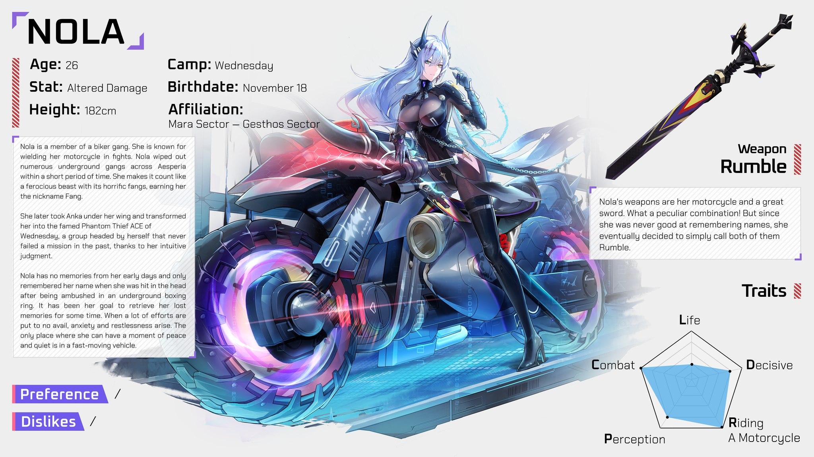
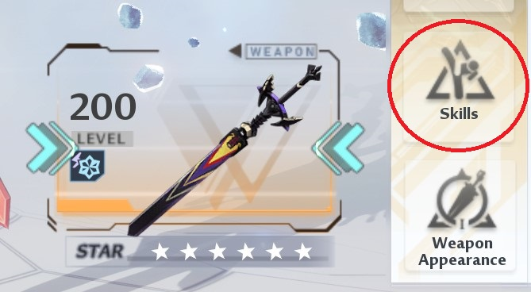
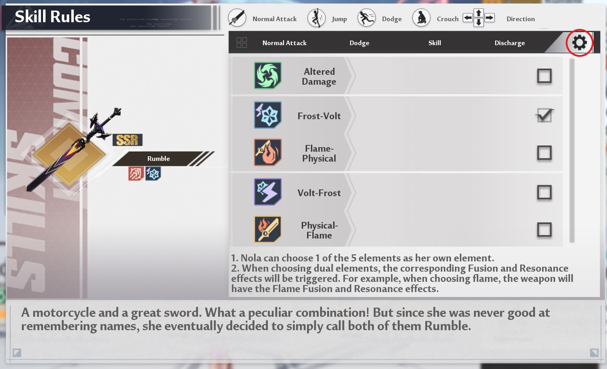

## Nola
Nola is the newest Altered character (the fourth one) who first appeared in version 4.2. Her weapon is called Rumble.

Occasionally, you might encounter Nola being called "Nora" online. I believe that this is due to a common translation quirk between Asian languages and English, where the sounds of "r" and "l" aren't always clearly differentiated. As a result, these two letters often get mixed up. Roslyn also had a similar issue being called "Loslyn".

## Video guides

Touch Me Not Physical - https://www.youtube.com/watch?v=jmNyNobeNys
Touch Me Not Frost - https://www.youtube.com/watch?v=521m4GYeCkc
Touch Me Not Flame - https://www.youtube.com/watch?v=gYRVI-2S5gw
Touch Me Not Volt - https://www.youtube.com/watch?v=gaboGoylLHo

## Tip 1

Remember to change Nola's element depending on your current weapon setup! It's easy to forget this in some game modes like Evolution Vanguard. Forgetting to do this can significantly affect your damage output.

To change the element, go to the `Weapons` menu, then click on `Skills`.

Then select the Cog icon here pick the element according to your weapon setup.

## Tip 2

Press forward and hold right click for at least a second to activate the dodge skill Sonic Skyrider (Nola's bike) to move around just like a vehicle but mounting this is faster! However it does use stamina unlike a proper mount. You can also release right click after the bike appears, but continue holding forward.

## Tip 3

After 10 seconds of using the above Sonic Skyrider in the Overworld, run into any non-boss enemy to instantly execute it!