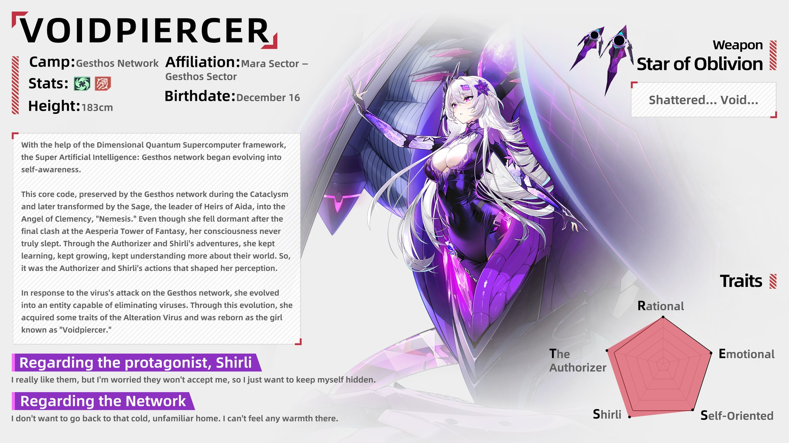
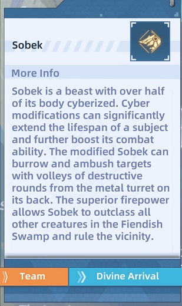

## Void Piercer
Void Piercer is the latest Altered character (the fifth one) who first appeared in version 4.6. Her weapon is called **Star of Oblivion**.

## Video guides

- Touch Me Not Physical - [https://www.youtube.com/watch?v=jmNyNobeNys](https://www.youtube.com/watch?v=kLlU4Quch1s)
- Touch Me Not Frost - [https://www.youtube.com/watch?v=521m4GYeCkc](https://www.youtube.com/watch?v=_CfhF8Tglyk)
- Touch Me Not Flame - [https://www.youtube.com/watch?v=gYRVI-2S5gw](https://www.youtube.com/watch?v=nyq6u3nWggE)
- Touch Me Not Volt - N/A

## Tip 1

When Star of Oblivion is in the active team, then you can teleport straight to any boss AND it automatically switches to a channel where the boss is alive. Open map > World Boss > Pick boss and press GO > Divine Arrival.

## Tip 2

Holding skill is faster to use than tapping it.

## Tip 3

Her matrix 2 piece is very strong as it ignores 35% of the target's shield when equipped on Star of Oblivion.
