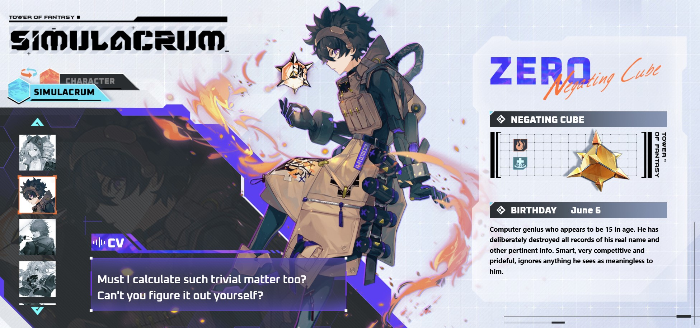
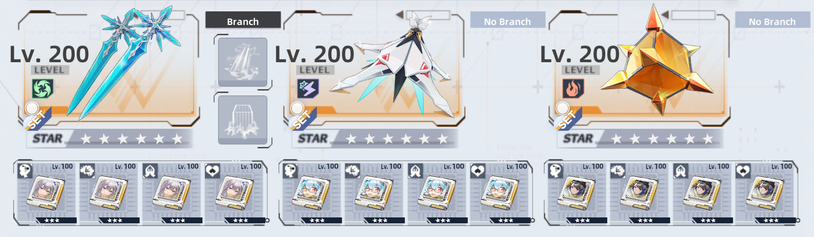
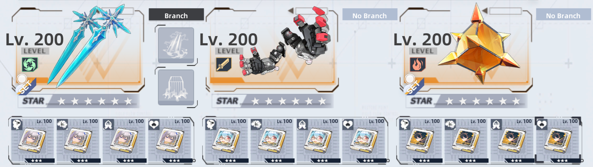
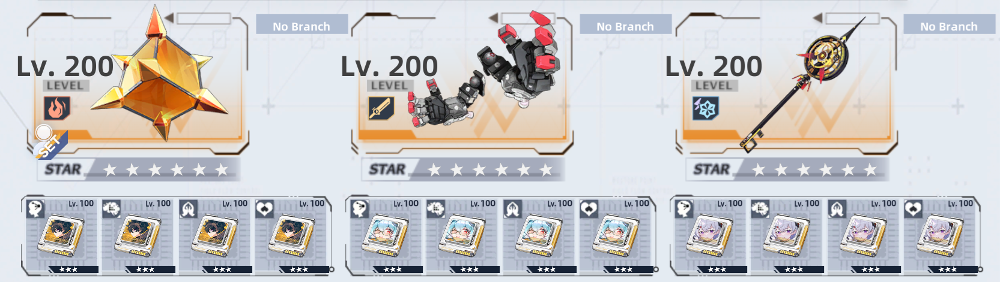

# Zero (Negating Cube)  
Benediction unit from the standard banner.

## Element Type  
 **Flame**  
- When the weapon is fully charged, the next attack will **set the target on fire** for 8 seconds.  
- Burning enemies take **58% of ATK as damage per second**.  
- **Healing efficacy is reduced by 50%** on ignited targets.  

## Elemental Resonance  

- **Flame Resonance:**  
  - **+15% Flame ATK** and **+25% Flame Resistance**.  
  - Activates when equipping **2 or more Flame weapons**.  
  - Works in off-hand, but **does not stack with the same effect**.  

- **Flame Benediction:**  
  - **+5% Flame ATK for the entire team** when Benediction Resonance is active.  

---

## Kit and gameplay
<iframe width="720" height="480" src="https://www.youtube.com/embed/x6dqtlqtE5I" frameborder="0" allow="accelerometer; autoplay; clipboard-write; encrypted-media; gyroscope; picture-in-picture" allowfullscreen></iframe>  

---

## Benediction guide
Zero is the most balanced Benediction unit in Tower of Fantasy, possessing nearly all the key attributes of a support-class character. He plays a main-hand role in most teams, providing healing and buffs through his passive ability, which remains active even when he is swapped out for other weapons. This grants great flexibility in gameplay.

As the saying goes, "Jack of all trades, master of none," the same applies to Zero. Despite having a large kit, his healing and shielding are insufficient to keep teammates' HP high at all times. The same issue arises with his passive damage boost in 8 player content, if a teammate fails to pick up his damage orb while his skill is on cooldown, its maximum value is lost.

While still a solid option, he is not recommended for solo content. However, when paired with 2 other Benediction players, Zero excels as a buffer and supportive healer. His greatest utility lies in his discharge ability, which when timed correctly can prevent many ally deaths by providing 3 seconds of damage immunity. Personally, he is the most enjoyable support to play in the game, thanks to his unique attacks and fast charge rate.

Build Recommendations
Since Zero spends a significant amount of time on the field, Cocoritter or Zero matrices work well. However, to maintain Cocoritter's full duration, you must continuously spawn healing orbs or use another off-field healing source. Alternatively, Zero can be built as an off-field unit, allowing him to equip matrices like Grey Fox, Fiona, or Brevey, though this setup requires another weapon on the team to use Claudia's 4 piece matrix.

Claudia's matrices reduce the skill cooldown of other weapons when you hit enemies with the skill of the weapon equipped with these matrices. For example, when equipped on Fiona, they can reduce the cooldown of other weapons by 30 seconds at A3 (3 seconds Cooldown reduction on every skill hit, and Fiona hits 10 times per skill). Since Fiona can continuously spam her skill with every discharge, this allows Zero's skill to be cast every time Fiona's skill is used.

Team Compositions
Zero offers great flexibility in team-building. A low-cost option is running him with Lyra and Cocoritter, which provides strong damage boosts, shielding, and healing over time. Thanks to Zero's fast charge rate, Cocoritter will also be able to discharge frequently.

- Nemesis instead of Cocoritter: This makes healing significantly easier, but at the cost of a major damage boost.

- Brevey instead of Lyra: This is a strong alternative for new content, providing continuous off-field healing, Greying bite cleanse, and burst healing from her skill. Additionally, Brevey's passive off-field damage can also trigger Zero's orbs.

- Fiona instead of Cocoritter: This allows for frequent Zero discharges while also granting allies damage immunity and extra healing from her dodge attacks.

For 2 benediction team compositions, a fully optimized buffing setup with Zero, Lyra, and Grey Fox is also possible, but that will be covered in a separate guide.

Traits
Brevey's trait is the best option for any team with Zero, as he spends most of his time on the field. If using Grey Fox, remember to equip her trait. If you lack both weapons, Echo's trait is also a viable choice.

---

## Team Comps

Here are some example teams to work towards. If you're a beginner and have Zero, then aim to get any other standard Benediction characters like Cocoritter and Pepper.

Note that these examples are assuming that Zero is the main on-field unit.

- If you don't own Fiona, she can be replaced with Cocoritter
- If you don't own Brevey she can be replaced with Lyra
- Fiona's matrices can be replaced by P2 Lyra and P2 Nemesis or another set of P4 Zero or Cocoritter matrices

In this team:
1. Fiona is an off field buffer
2. Brevey is an off field healer
3. Zero is the on field buffer
   
 

In this team:
1. Zero is the on field buffer
2. Lyra is an off field buffer
3. Grey Fox is an off field buffer
   
  

In this team:
1. Fiona is an off field buffer
2. Lyria is an off field buffer
3. Zero is the on field buffer

### Trait options

- If you are using Grey Fox in a team with Zero, then it's better to equip Grey Fox's trait
- Teststs

---

## Advancements  

| ⭐ | Effect |
|----|--------|
| 1 | Deal damage and produce a healing orb (lasts 20s). Picking up the orb restores **60% of ATK as HP**. **Cooldown: 2s**. |
| 2 | Increase the weapon's **base ATK growth by 16%**. |
| 3 | Reduce **skill cooldown from 60s to 30s**. While the shield is active, **restore HP equal to 30% of ATK per second**. |
| 4 | Increase the weapon's **base HP growth by 32%**. |
| 5 | Damaging a target produces a **damage orb** (lasts 20s). Picking it up **increases all damage and healing by 2% for 30s**. Stacks **up to 10 times**. **Cooldown: 2.5s**. |
| 6 | Using a **Skill** grants allies **healing orbs and damage orbs** equal to the number of Omnium Cubes. |

---

## Matrix Set  

| Set Bonus | Effects |
|-----------|---------|
| **2-piece** | Upon using a **discharge skill**, gain a **shield** equal to **150% / 200% / 250% / 300% of ATK** for **6 seconds**. |
| **4-piece** | While the shield is active, **you and teammates deal 16% / 20% / 24% / 28% more damage**. |

---

## Trait  

### **1,200 Awakening Points**  
#### **Zero: Accurate Calculation**  
- When Zero uses a **weapon skill**, reduce cooldown time for **Relics in cooldown by 1.5s**.  
- Can activate **once per weapon every 5 seconds**.  

### **4,000 Awakening Points**  
#### **Zero: Overall Planning**  
- When Zero uses a **weapon skill**, reduce cooldown time for **Relics in cooldown by 3s**.  
- Can activate **once per weapon every 5 seconds**.  
