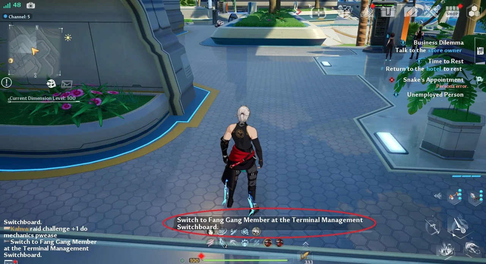
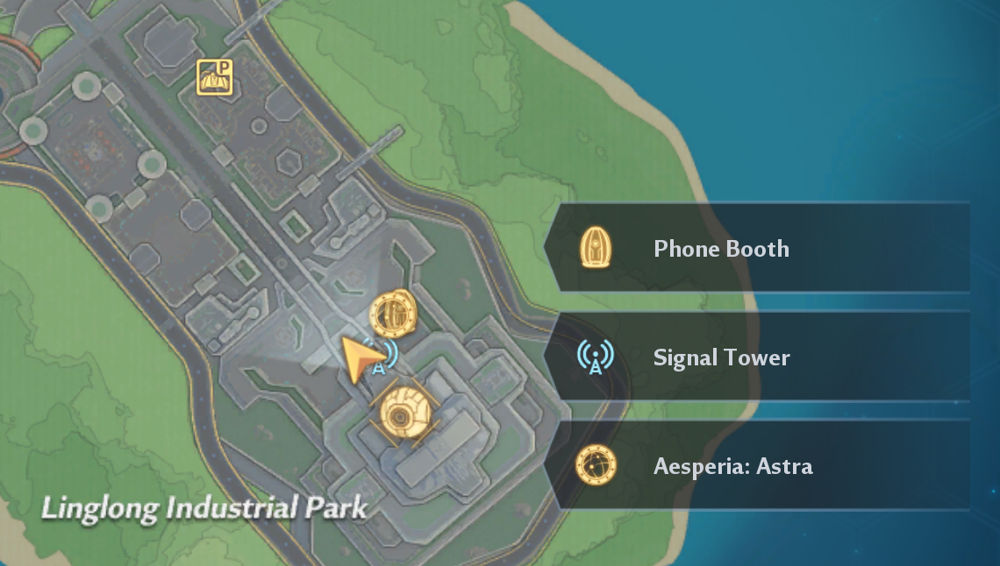
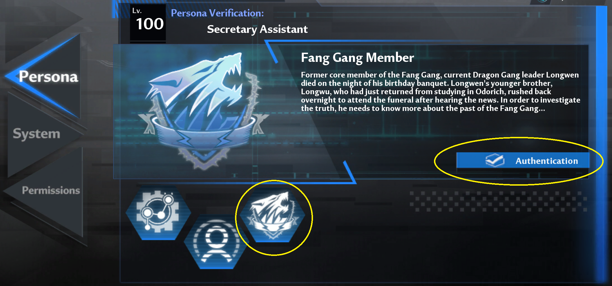

## 4.x video guides

Here's the links for Gateoo's FAQ guides for Network:

- [4.0](https://www.youtube.com/watch?v=K-1yZqLyKHU)
- [4.1](https://www.youtube.com/watch?v=GoB6GxdDjqE)
- [4.2](https://www.youtube.com/watch?v=MLGFj3HGFnE)

## Fang gang member mission (Snake's Appointment)

During a new 4.2 quest you'll be asked to switch to be a Fang Gang member at a Terminal Management Switchboard, and can't continue without doing so. It's not immediately obvious how to do this, so follow these steps!

The quest name is: Snake's Appointment

Teleport to any `Phone Booth` which contains a terminal management switchboard, such as the starting one in Network highlighted below. Phone booths are an egg shape.

Go inside the phone booth using `Activate` button when you're in it, and go to one of the 4 terminals at the other end.

`Activate` one then under the Persona menu select the Wolf icon and press `Authentication` to join the gang. The `Authentication` button will disappear when you join, and the Wolf icon moves to the very left (brilliant UI as usual) Now you can continue the quest.

