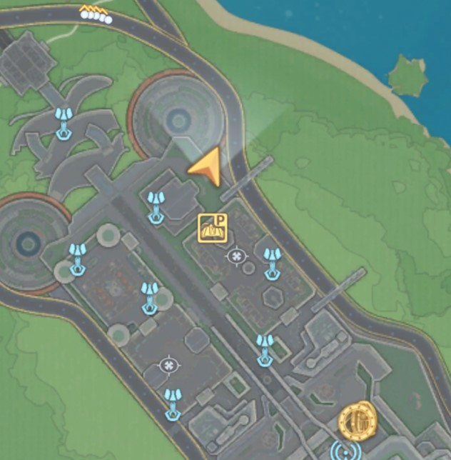
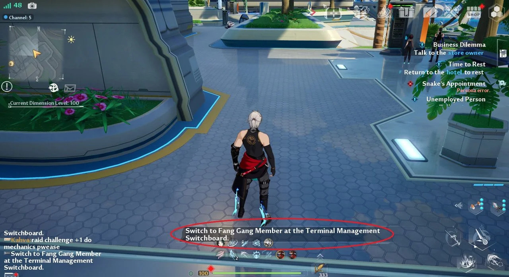
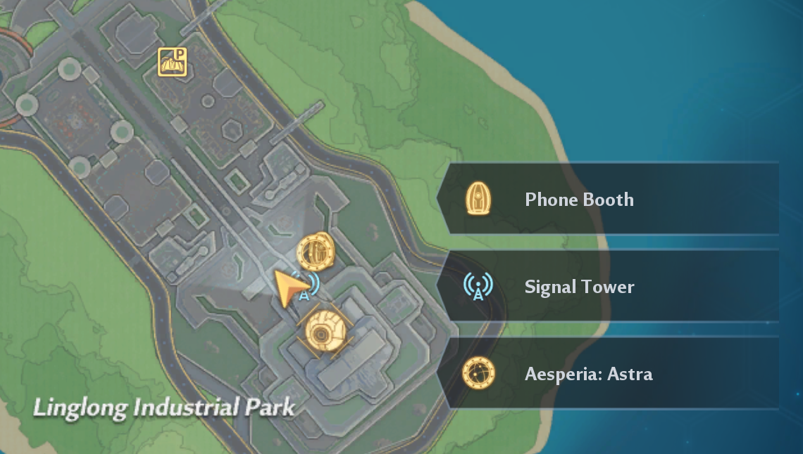
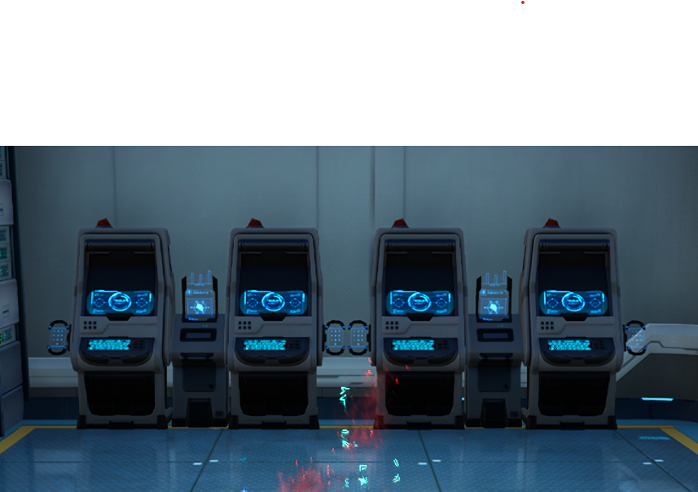
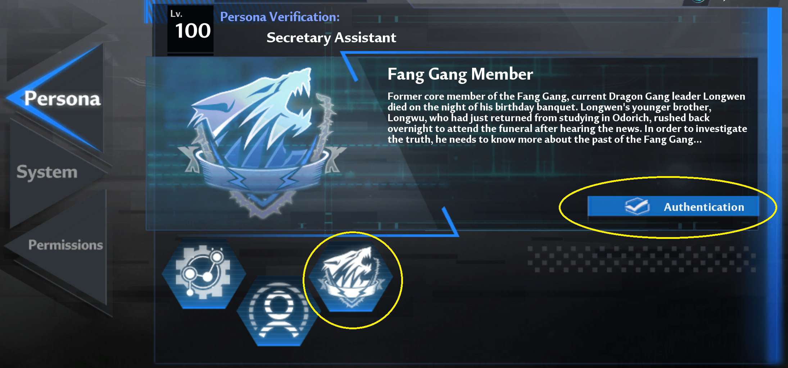

## 4.x video guides

Here's the links for Gateoo's FAQ guides for Network:

- [4.0](https://www.youtube.com/watch?v=K-1yZqLyKHU)
- [4.1](https://www.youtube.com/watch?v=GoB6GxdDjqE)
- [4.2](https://www.youtube.com/watch?v=MLGFj3HGFnE)

## Norn trick to bypass weekly conversion limit

Usually there's a weekly limit on how much Data Sources you can convert to Norn at yellow terminals, which is 5000 Data Sources. But you can convert double if you find two yellow terminals next to each other. Simple stand in the middle of them and do not move. Click on one link and do the `Efficient Encyption` to do the conversion.

When you reach the limit, you will see that one terminal has greyed out text, but you can still click on the other! So continue using `Efficient Encyption` to convert up to 10k Data Sources. If you move at all during this process then both terminals will be locked.

There is an easy to reach pair of yellow terminals at the start of Network, and a few more elsewhere.

## Fang gang member mission (Snake's Appointment)

During a new 4.2 quest you'll be asked to switch to be a Fang Gang member at a Terminal Management Switchboard, and can't continue without doing so. It's not immediately obvious how to do this, so follow these steps!

The quest name is: Snake's Appointment

Teleport to any `Phone Booth` which contains a terminal management switchboard, such as the starting one in Network highlighted below. Phone booths are an egg shape.

Go inside the phone booth using `Activate` button when you're in it, and go to one of the 4 terminals at the other end.

`Activate` one then under the Persona menu select the Wolf icon and press `Authentication` to join the gang. The `Authentication` button will disappear when you join, and the Wolf icon moves to the very left (brilliant UI as usual) Now you can continue the quest.

