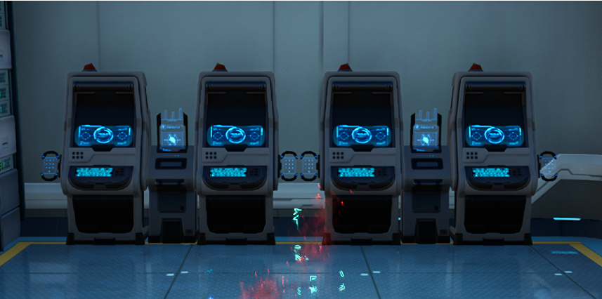

## Fang gang member mission

During a 4.2 quest you'll be asked to switch to be a Fang Gang member at a Terminal Management Switchboard.

The quest name is: ...

Teleport to any `Phone booth` which contains a terminal management switchboard, such as the starting one in Network highlighted below.

Go inside the phone booth using `Activate` button when you're in it, and go to one of the 4 terminals at the other end.

`Activate` one then under the Persona menu select the Wolf icon and press `Authentication` to join the gang.

Not obvious but something got lost in translation as usual!
